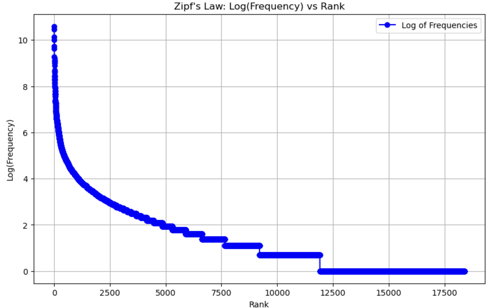

This piece of code is to use the word tokenizer and sent tokenizer of nltk for Natural Language processing while following the below rules

Rules:
Punctuations should be separated but NOT discarded. Also:
- You only separate punctuations that occurred only at the leading or trailing positions of a word. If a punctuation (or punctuations) occur(s) within a word, you do not separate the word. For example, "$3.19" should be separated into "$" and "3.19". If NLTK word_tokenize() didn't adhere to it for any instance, do NOT take NLTK's tokenization and override yourself by separating ONLY the leading and the trailing punctuations.
- If a consecutive (leading and trailing) punctuations were tokenized as one token (e.g. "...", "--") by NLTK word_tokenize(), treat them as one token/word.
- Or if a consecutive (leading and trailing) punctuations were tokenized as multiple tokens (e.g. "!", "!" from "!!") by NLTK word_tokenize(), treat them as multiple tokens (i.e, as is).
- Also if a word ends with a period (.), you don't have to check if it is a known acronym (e.g. "mr.", "m.p.g.", "e.g.", "etc."). Just use NLTK's tokenization/split.

Contractions must be expanded and converted to the root/lemma tokens. Although some contractions are ambiguous (e.g. "they'd" could be "they would" or "they had"), in this assignment you can make these simplifying assumptions.
NLTK word_tokenize() splits contractions at the quote character (') or special cases such as "n't". For example, it splits "they'd" to two tokens 'they' and "'d" , and "don't" to 'do' and "n't".

Contractions to convert:
- "n't" -- assume "not" for all instances (e.g. "don't" -> "do" and "not"), EXCEPT for these special cases (where you'll need to look at the preceding token to determine):
- won't -- "will" and "not"
- can't -- "can" and "not"
- shan’t -- "shall" and "not"
- "'ll" -- assume "will" for all instances; e.g. "they'll" -> "they" and "will"
- " 've" -- assume "have" for all instances; e.g. "they've" -> "they" and "have"
- "'d" -- assume "would" for all instances; e.g. "they'd" -> "they" and "would"
- "'re" -- assume "are" for all instances; e.g. "they're" -> "they" and "are"
- "'s " -- assume possessive (i.e., an apostrophe-s); e.g. "phone's" -> "phone" and "'s" ==> thus no change, EXCEPT for these special cases:
  - "let's" -- "let" and "us"
  - obvious contraction of "is" (mostly used with a singular pronoun or a wh-word; e.g. "it's" -> "it" and "is"). In this assignment, apply this rule to these words: "he's", "she's", "it's", "that's", "here's" and "there's", "what's", "when's", "where's", "which's", "who's" and "how's".
other special cases:
  - i'm -- "i" and "am".
Note that, if a word contains multiple contractions (e.g. "shouldn't've"), you must separate ALL of them (e.g. "should", "not", "have").

### Zip-f plot for the word frequencies

